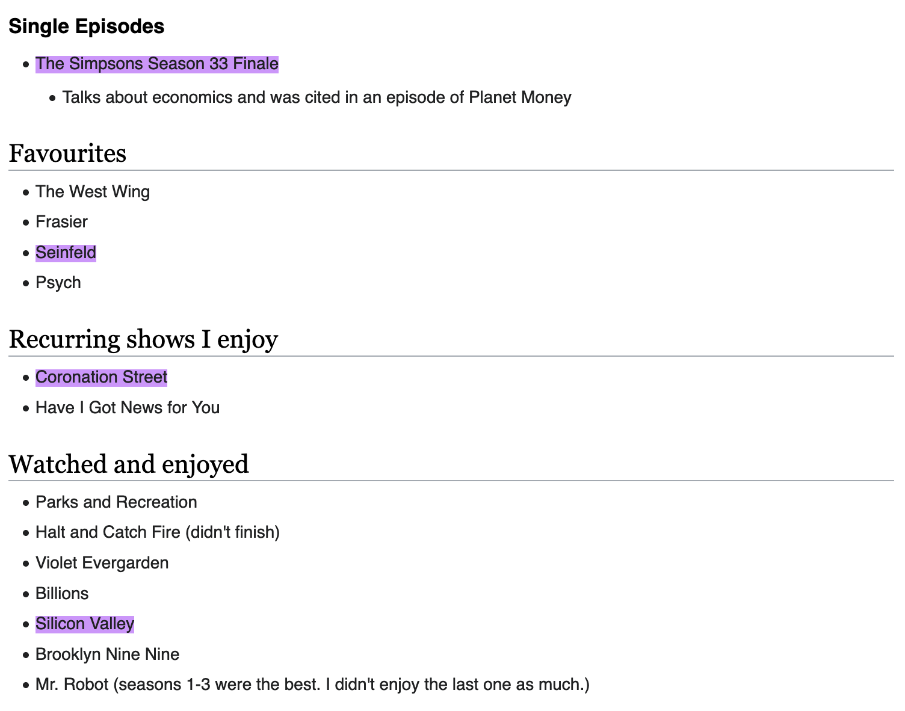

# annotate.js

annotate.js provides inline text annotation highlights for web pages.

With annotate.js, you can interactively highlight text on a web page and get a shareable link with your saved highlights.

## Getting Started

To start using annotate.js, first copy the script and style sheet onto your website:

    git clone https://github.com/capjamesg/annotate.js
    cp annotate.js/annotate.js YOUR_SITE_ASSETS_FOLDER
    cp annotate.js/annotate.css YOUR_SITE_ASSETS_FOLDER

Next, embed the annotate.js CSS and JavaScript files on your website:

    <link rel="stylesheet" href="YOUR_SITE_ASSETS_FOLDER/annotate.css">
    

Now you are ready to use the script!

## Usage Guide

To annotate, press `Command + K` at the same time. Then, highlight any text on the page that you want to appear in your shared link. You can do this by dragging your mouse over any text on the page. A box will appear in the top right corner that tracks how many highlights you have created in your session.

When you are done, press `Copy URL` to copy the URL with your highlights to your clipboard. You can then paste this URL anywhere to share your highlights.

## Example

Open the following URL:

    https://wiki.jamesg.blog/index.php?title=TV_Shows#w=t,The%20Simpsons%20Season%2033%20Finale,#text=Seinfeld,#text=Coronation%20Street,#text=Silicon%20Valley

This URL highlights four TV shows on my TV show watch list:

- The Simpsons Season 33 Finale
- Seinfeld
- Coronation Street
- Silicon Valley

## Contributing

If you have a suggestion on how to improve this script, please feel free to file an issue so improvements can be discussed before being turned into Pull Requests.

## License

This code is released into the public domain.

## Contributors

- capjamesg